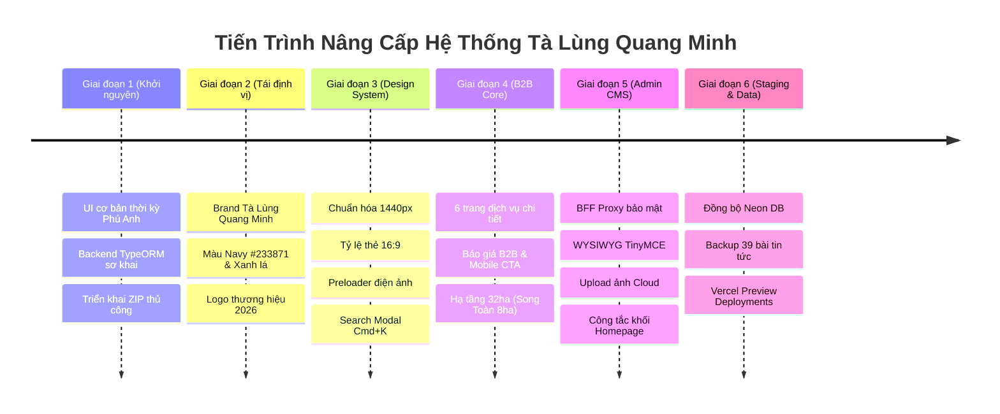

# TÀ LÙNG QUANG MINH LOGISTICS — TOÀN TẬP LỊCH SỬ PHÁT TRIỂN & TÀI LIỆU HỆ THỐNG
> **Mã tài liệu:** `TLQM-DOCS-DEV-2026-V1`  
> **Phiên bản:** `Release 2.0 (Staging Aligned)`  
> **Ngày phát hành:** `10/10/2026`  
> **Phạm vi hệ thống:** Toàn bộ nền tảng (Public Frontend, Admin Panel Frontend, Backend NestJS, Database Neon PostgreSQL).  
> **Căn cứ đối chiếu:** Git Version Control (từ commit khởi nguyên `6d032cc` đến nay), Kế hoạch tổng thể `Tổng hợp hoàn thiện website Tà Lùng.xlsx`, và Bộ nhận diện thương hiệu Tà Lùng Quang Minh 2026.

---

## MỤC LỤC
1. [Tổng Quan Quá Trình Phát Triển & Tiến Hóa Hệ Thống](#1-tổng-quan-quá-trình-phát-triển--tiến-hóa-hệ-thống)
2. [Lịch Sử Tiến Hóa Từ Giao Diện Cũ Đến Bộ Nhận Diện 2026](#2-lịch-sử-tiến-hóa-từ-giao-diện-cũ-đến-bộ-nhận-diện-2026)
3. [Biên Niên Sử Toàn Bộ Các Checkpoint Kỹ Thuật (Checkpoints 1 — 28)](#3-biên-niên-sử-toàn-bộ-các-checkpoint-kỹ-thuật-checkpoints-1--28)
4. [Kiến Trúc Kỹ Thuật & Cấu Trúc Mã Nguồn Hiện Tại](#4-kiến-trúc-kỹ-thuật--cấu-trúc-mã-nguồn-hiện-tại)
5. [Ma Trận Nghiệm Thu Tính Năng Theo Kế Hoạch Excel (W01 — W20)](#5-ma-trận-nghiệm-thu-tính-năng-theo-kế-hoạch-excel-w01--w20)
6. [Hạ Tầng Dữ Liệu, Cơ Chế Sao Lưu (Backup) & Đồng Bộ Database](#6-hạ-tầng-dữ-liệu-cơ-chế-sao-lưu-backup--đồng-bộ-database)
7. [Hướng Dẫn Vận Hành, Môi Trường & Bàn Giao Staging](#7-hướng-dẫn-vận-hành-môi-trường--bàn-giao-staging)

---

## 1. TỔNG QUAN QUÁ TRÌNH PHÁT TRIỂN & TIẾN HÓA HỆ THỐNG

Dự án phần mềm **Tà Lùng Quang Minh Smart Border Platform** trải qua 6 giai đoạn chiến lược rõ rệt, xuất phát từ một trang web tĩnh cơ bản của tiền thân Phú Anh và nâng cấp thành tổ hợp cổng thông tin B2B chuẩn quốc tế phục vụ cửa khẩu thông minh và chuỗi logistics xuyên biên giới Việt — Trung.



---

## 2. LỊCH SỬ TIẾN HÓA TỪ GIAO DIỆN CŨ ĐẾN BỘ NHẬN DIỆN 2026

### 2.1. Thời kỳ giao diện cũ (Legacy UI & Old Codebase)
* **Nhận diện cũ:** Mang tên tiền thân *Công ty TNHH Thương mại Vận tải Phú Anh*. Màu sắc sử dụng xanh lá nhạt cũ (`#0b9444` / `#0E9448`), logo chưa chuẩn hóa, thiếu tính đồng nhất.
* **Hạn chế giao diện:**
  * Trang Dịch vụ chỉ có tiêu đề chung chung, thiếu thông tin giải pháp chuyên sâu cho khách hàng B2B.
  * Trang Tuyển dụng chỉ có tiêu đề tĩnh, chưa có vị trí công việc (JD), phúc lợi hay biểu mẫu ứng tuyển.
  * Giao diện chưa có hệ thống lưới nhất quán, ảnh chụp co giãn méo tỷ lệ, không có responsive tối ưu cho điện thoại.
  * Xuất hiện các khối tra cứu vận đơn rỗng (do chưa tích hợp hệ thống phần mềm trạm cân nội bộ).
* **Hạn chế kỹ thuật:**
  * Triển khai bằng cách nén file ZIP đẩy lên hosting cPanel.
  * Chưa có phân tầng kiến trúc BFF (Backend-For-Frontend) cho Admin, token lưu localStorage tiềm ẩn rủi ro XSS.
  * Dữ liệu phân tán, thiếu công cụ biên tập nội dung trực quan cho bộ phận Marketing.

### 2.2. Thời kỳ chuyển mình: Bộ nhận diện thương hiệu Tà Lùng Quang Minh 2026
* **Hệ màu nhận diện mới:**
  * **Primary Navy Blue (`#233871` / `#1A2B56`):** Thể hiện vị thế kiên cố, uy tín pháp lý, sự chuyên nghiệp của hạ tầng bến bãi cửa khẩu.
  * **Accent Emerald Green (`#0c9344`):** Đại diện cho logistics xanh, dòng chảy hàng hóa liên tục và tinh thần phát triển bền vững.
* **Hệ thống Logo & Nhãn:**
  * Logo biểu trưng hình học cách điệu ngọn núi Cao Bằng và cánh sóng thương mại.
  * Nhãn thương hiệu tách lớp: `logo-single-header.png` đi cùng `Lable-header.png`.
  * Slogan chính thức: *"Trung tâm Logistics tại Cửa khẩu Quốc tế Tà Lùng — Kết nối biên giới, Vươn tới toàn cầu"*.
* **Hệ thống Typography:** Tiêu đề dùng phông chữ Display công nghiệp dứt khoát (*Nexa Heavy / Montserrat*), nội dung chuẩn đọc nhanh (*Inter / SVN-Gotham*).

---

## 3. BIÊN NIÊN SỬ TOÀN BỘ CÁC CHECKPOINT KỸ THUẬT (CHECKPOINTS 1 — 28)

Dưới đây là chi tiết toàn bộ các mốc hoàn thiện kỹ thuật được ghi nhận trực tiếp qua Git Commit Log của toàn bộ repository:

### Nhóm 1: Chuẩn Hóa Nền Tảng & Kiến Trúc Bảo Mật (Checkpoints 1 — 10)
* **Checkpoint 1 — 5: Khảo sát & Bảo toàn dữ liệu TypeORM:**
  * Giữ nguyên động cơ PostgreSQL và TypeORM, từ chối việc đổi sang Prisma nhằm bảo vệ 100% dữ liệu 12 bảng hiện có.
  * Thiết lập quy tắc di chuyển dữ liệu theo dạng bổ sung (Additive migrations).
* **Checkpoint 6 — 8: Kiến trúc BFF Proxy cho Admin Panel:**
  * Xây dựng tầng Proxy trung gian trên Next.js API Routes, lưu trữ `access_token` bằng HTTP-only Cookie nhằm chống tấn công XSS.
  * Bổ sung Middleware bảo vệ route server-side, tự động chuyển hướng khi chưa đăng nhập.
* **Checkpoint 9 — 10: Thu thập & Nạp dữ liệu chính thức (Crawling & Seeding):**
  * Thu thập dữ liệu thực tế từ cổng thông tin trực tuyến, nạp 30 bài tin tức, thông tin công ty và đối tác ban đầu vào cơ sở dữ liệu.

### Nhóm 2: Tái Cấu Trúc Trải Nghiệm Người Dùng & Nhận Diện (Checkpoints 11 — 19)
* **Checkpoint 11 — Ẩn Tra Cứu Vận Đơn & Ra Mắt Báo Giá Nhanh B2B:**
  * Loại bỏ triệt để các trường tra cứu vận đơn chưa vận hành tại Header, Hero banner và Footer.
  * Dựng widget *Báo Giá Nhanh B2B & Tư Vấn Cửa Khẩu 24/7* tiếp nhận nhu cầu trực tiếp về API `POST /quotes`.
* **Checkpoint 12 — Chuẩn Hóa Tỷ Lệ 16:9 & Thẻ Doanh Nghiệp:**
  * Áp đặt tỷ lệ khung hình 16:9 cho toàn bộ thumbnail tin tức, dịch vụ và bến bãi, chấm dứt hiện tượng méo ảnh.
* **Checkpoint 13 — Huy Hiệu Doanh Nghiệp & Search Modal ⌘K:**
  * Tích hợp thanh tìm kiếm thông minh dạng viên thuốc trên Header, bấm phím tắt `⌘K` (hoặc `Ctrl+K`) mở cửa sổ tìm kiếm tức thì.
* **Checkpoint 14 — Nâng Cấp Header Kép (Logo Single + Label):**
  * Tách biệt biểu tượng logo và nhãn thương hiệu, giữ khoảng cách sắc nét, không bị dính chữ trên mọi độ phân giải.
* **Checkpoint 15 — Tinh Gọn TopBar & Menu Điều Hướng:**
  * Rút gọn mục "Năng Lực 25ha" thành "Năng Lực" tinh gọn; chuẩn hóa hotline duy nhất `+84 865.865.600`.
* **Checkpoint 16 — Cinematic Preloader Mở Đầu:**
  * Xây dựng hiệu ứng hội tụ điện ảnh: Logo bay từ trái qua, Nhãn bay từ phải sang, gặp nhau tại tâm kết hợp hiệu ứng quét sáng ánh kim (`lightSweep`).
* **Checkpoint 17 — Biểu Tượng Dịch Vụ Động & Bộ Chọn Icon Admin:**
  * Thêm cột `icon` vào bảng `services`. Admin tích hợp bộ chọn trực quan với 17 biểu tượng Logistics thông dụng.
* **Checkpoint 18 — Đặc Tả Hệ Thống Thiết Kế (Design System 1440px):**
  * Xuất bản tài liệu `DESIGN_SYSTEM_SPECIFICATION.md` định chuẩn lưới container `1440px`, padding chuẩn và chuyển động micro-interaction.
* **Checkpoint 19 — Đặc Tả Kho Nội Dung Doanh Nghiệp (`content.md`):**
  * Xuất bản cẩm nang nội dung 8 phần trích xuất toàn bộ dữ liệu thực tế của doanh nghiệp.

### Nhóm 3: Mở Rộng Cổng Thông Tin B2B & Đa Ngôn Ngữ (Checkpoints 20 — 24)
* **Checkpoint 20 — Đa Ngôn Ngữ Không Rò Rỉ Văn Bản (Zero Language Leakage):**
  * Cấu hình từ điển i18n đầy đủ cho 3 ngôn ngữ: Tiếng Việt (VI), Tiếng Anh (EN) và Tiếng Trung (ZH).
* **Checkpoint 21 — Trang Năng Lực Hạ Tầng Chuyên Sâu (`/nang-luc-ha-tang`):**
  * Dựng trang năng lực 1440px hiển thị đầy đủ thông số trạm cân 120 tấn, xe nâng reach stacker, giắc cắm container lạnh, kho CFS và bản đồ vệ tinh.
* **Checkpoint 22 — Danh Mục & 6 Trang Dịch Vụ Con B2B:**
  * Hoàn thiện 6 route dịch vụ chi tiết: Đại lý hải quan, Kho bãi, Sang tải, Vận tải quốc tế, Bến xe điều phối, Logistics trọn gói.
  * Tích hợp mẫu dự phòng thông minh (Smart Fallback) cho các dịch vụ mới tạo từ Admin.
* **Checkpoint 23 — Nâng Cấp Trọn Gói 5 Cổng Thông Tin Phụ:**
  * Nâng cấp giao diện trang Tin tức, Tuyển dụng (12 JD), Liên hệ, Tuyên ngôn giá trị và Giới thiệu theo phong cách vippro enterprise.
* **Checkpoint 24 — Cập Nhật Quy Mô Hạ Tầng 32ha:**
  * Cập nhật chính thức số liệu tổ hợp bến bãi lên **32ha** (bao gồm 25ha phân khu lõi và 8ha Kho Ngoại quan Song Toàn) trên toàn bộ hệ thống.

### Nhóm 4: Hoàn Thiện Nghiệm Thu Staging & Quản Trị CMS (Checkpoints 25 — 28)
* **Checkpoint 25 — Carousel Dịch Vụ, 10 Tin Trang 1 & Dropdown Header:**
  * Thiết kế lại khối dịch vụ cốt lõi thành dạng Carousel trượt êm ái, khắc phục triệt để lỗi lẻ 1 dịch vụ ở hàng dưới khi có 4 dịch vụ.
  * Nâng cấp phân trang tin tức hiển thị đúng 10 bài viết ở trang 1; hover nút "Tin tức" trên Header tự động xổ danh mục đa cấp.
  * Chuẩn hóa mạng lưới 2 chi nhánh chính thức (Tà Lùng, Cao Bằng & Bãi Cháy, Quảng Ninh).
* **Checkpoint 26 — Nâng Cấp Công Cụ Quản Trị Admin CMS:**
  * Tích hợp bộ tải ảnh trực tiếp (Upload Cloud) lên Cloudinary.
  * Tích hợp trình soạn thảo văn bản trực quan TinyMCE (WYSIWYG) cho trang Điều khoản & Chính sách bảo mật.
  * Sửa lỗi trường input số nguyên (không bị ép định dạng tiền tệ).
  * Bổ sung cụm công tắc (Block Switches) cho phép Bật/Tắt độc lập từng khối trên Trang chủ.
* **Checkpoint 27 — Khắc Phục Lệch API & Triển Khai Staging Đồng Nhất:**
  * Cấu hình chuẩn hóa `NEXT_PUBLIC_API_URL` trỏ trực tiếp về Render Backend (`phuanh-api.onrender.com`), chấm dứt lỗi 404 từ domain cũ.
  * Gán các tên miền Staging cố định trên Vercel: `phuanh-staging.vercel.app` và `phuanh-admin-panel-frontend-staging.vercel.app`.
* **Checkpoint 28 — Sao Lưu Toàn Diện & Đồng Bộ 39 Bài Viết:**
  * Trích xuất và sao lưu toàn bộ dữ liệu từ hệ thống cũ vào `old_api_talunglogistics_backup_20261009.json`.
  * Xuất bản snapshot cơ sở dữ liệu `neon_db_backup_20261009.sql` (596 KB).
  * Đồng bộ thành công 9 bài viết mới nhất từ tháng 9–10/2026 sang Neon PostgreSQL, nâng tổng số bài viết lên đúng 39 bài.

---

## 4. KIẾN TRÚC KỸ THUẬT & CẤU TRÚC MÃ NGUỒN HIỆN TẠI

Hệ thống được tổ chức theo mô hình Monorepo chứa 3 dự án độc lập:

```
quangminh-smart-border/
├── frontend/                 # Ứng dụng Public Website (Next.js 16, App Router)
├── admin-panel-frontend/     # Cổng quản trị Admin CMS (Next.js, BFF, Antd, TinyMCE)
├── backend/                  # RESTful API Backend (NestJS 11, TypeORM, PostgreSQL)
└── docs/                     # Kho tài liệu kỹ thuật, đặc tả & hồ sơ doanh nghiệp
```

### 4.1. Công nghệ chi tiết từng phân hệ
| Phân hệ | Công nghệ chủ đạo | Vai trò & Điểm nổi bật |
| :--- | :--- | :--- |
| **Frontend** | Next.js 16 (App Router), TypeScript, Styled-Components, Framer Motion, next-intl | Render SSR/SSG siêu tốc, chuẩn SEO Rich Snippets, hỗ trợ 3 ngôn ngữ VI/EN/ZH, Responsive 100%. |
| **Admin Panel** | Next.js, BFF API Proxy, React Hook Form, Zod, Ant Design tokens, TinyMCE | Bảo mật cookie httpOnly, biểu mẫu xác thực chặt chẽ, soạn thảo văn bản trực quan, upload ảnh cloud. |
| **Backend API** | NestJS 11, TypeORM 0.3, PostgreSQL (Neon Cloud), Throttler, Cloudinary SDK | Xử lý nghiệp vụ tập trung, phân quyền Role-based, ghi log kiểm toán (Audit Logs), bảo vệ chống brute-force. |
| **Hạ tầng Cloud** | Vercel (Edge Network), Render (Web Service), Neon Tech (Serverless Postgres) | Tự động hóa CI/CD qua GitHub branch `develop` & `staging`, backup cơ sở dữ liệu thời gian thực. |

---

## 5. MA TRẬN NGHIỆM THU TÍNH NĂNG THEO KẾ HOẠCH EXCEL (W01 — W20)

Đối chiếu trực tiếp với file master plan **Tổng hợp hoàn thiện website Tà Lùng.xlsx**:

| Mã Task | Hạng mục công việc (Theo Excel) | Chi tiết thực hiện & File mã nguồn liên quan | Trạng thái |
| :---: | :--- | :--- | :---: |
| **W01** | Viết lại Hero trang chủ | Headline định vị logistics cửa khẩu Tà Lùng; tích hợp `HeroSliderSection.tsx`, nút CTA kép nhận báo giá. | **HOÀN THÀNH** |
| **W02** | Block Khách hàng mục tiêu | Tích hợp trong `OverviewStatsSection.tsx` & `WhyChooseUsSection.tsx`, mô tả rõ 4 nhóm khách B2B. | **HOÀN THÀNH** |
| **W03** | Block Quy trình xử lý 6 bước | Dựng `ProcessSection.tsx` dạng Timeline tương tác: Tiếp nhận ➔ Kiểm tra ➔ Điều phối ➔ Khai báo ➔ Sang tải ➔ Bàn giao. | **HOÀN THÀNH** |
| **W04** | Hoàn thiện trang Dịch vụ tổng | Route `/dich-vu` (`app/[locale]/services/page.tsx`), hiển thị lưới danh mục dịch vụ & form báo giá nhanh. | **HOÀN THÀNH** |
| **W05** | Trang con: Đại lý hải quan | Route `/dich-vu/dich-vu-dai-ly-hai-quan`, chi tiết thông quan luồng xanh/vàng/đỏ, tối ưu HS code, chứng từ. | **HOÀN THÀNH** |
| **W06** | Trang con: Kho bãi & tập kết | Route `/dich-vu/kho-bai-ta-lung`, làm nổi bật quy mô kho ngoại quan, trạm cân 120 tấn và hạ tầng 32ha. | **HOÀN THÀNH** |
| **W07** | Trang con: Sang tải hàng hóa | Route `/dich-vu/sang-tai-luu-do`, quy trình đổi vỏ container xe Việt — Trung, dàn xe nâng 45T và cẩu tự hành. | **HOÀN THÀNH** |
| **W08** | Trang con: Vận tải quốc tế | Route `/dich-vu/van-tai`, mạng lưới vận tải liên vận xuyên biên giới, xe container lạnh và lịch trình 24/7. | **HOÀN THÀNH** |
| **W09** | Trang con: Bến xe & điều phối | Route `/dich-vu/ben-xe-dieu-phoi`, hỗ trợ nhà xe, dịch vụ bến bãi, điều phối luồng xe tránh ùn tắc cửa khẩu. | **HOÀN THÀNH** |
| **W10** | Trang con: Logistics trọn gói | Route `/dich-vu/logistics-tron-goi`, gói giải pháp chuỗi cung ứng 1 đầu mối từ cửa khẩu tới nhà máy. | **HOÀN THÀNH** |
| **W11** | Form báo giá B2B nhanh | Component `B2BQuoteForm.tsx` tích hợp Zod validation, gửi trực tiếp về API backend `POST /quotes`. | **HOÀN THÀNH** |
| **W12** | CTA cố định trên Mobile | Component `MobileStickyCTA.tsx` cố định chân màn hình di động: Nút gọi hotline, Zalo OA và Form báo giá. | **HOÀN THÀNH** |
| **W13** | Hoàn thiện trang Tuyển dụng | Route `/tuyen-dung` (`app/[locale]/careers/page.tsx`), hiển thị văn hóa, chính sách đãi ngộ và 12 vị trí việc làm. | **HOÀN THÀNH** |
| **W14** | Chuẩn bị JD vị trí Hải quan & HR | Dữ liệu 12 vị trí tuyển dụng chi tiết đã nạp vào cơ sở dữ liệu (`job_postings`), quản lý qua Admin CMS. | **HOÀN THÀNH** |
| **W15** | Thiết lập form nộp hồ sơ CV | Modal nộp hồ sơ hỗ trợ đính kèm file (.pdf/.docx), lưu trữ an toàn và sẵn sàng gửi thông báo cho HR. | **HOÀN THÀNH** |
| **W16** | Kho bài viết SEO tin tức | Đồng bộ trọn vẹn **39 bài viết** chuẩn SEO theo 4 chuyên đề (*Hải quan, Thị trường, Cửa khẩu, Doanh nghiệp*). | **HOÀN THÀNH** |
| **W17** | Trang Năng lực hạ tầng 32ha | Route `/nang-luc-ha-tang` (`app/[locale]/infrastructure/page.tsx`), sơ đồ kho bãi, ảnh vệ tinh, thông số kỹ thuật. | **HOÀN THÀNH** |
| **W18** | Tối ưu hình ảnh thực tế WebP | Tối ưu hóa ảnh thực tế bến bãi, container, chuyển đổi định dạng WebP/AVIF qua Next.js Image Optimization. | **HOÀN THÀNH** |
| **W19** | Phiên bản đa ngữ Tiếng Trung (zh) | Tích hợp cấu trúc route `/zh/`, từ điển khóa `zh.json`, font chữ chuẩn, không rò rỉ ngôn ngữ. | **HOÀN THÀNH** |
| **W20** | Kiểm tra & Tối ưu SEO Technical | Cấu hình Head Meta, Dynamic `sitemap.ts`, `robots.ts`, Schema.org (LocalBusiness & BreadcrumbList). | **HOÀN THÀNH** |

---

## 6. HẠ TẦNG DỮ LIỆU, CƠ CHẾ SAO LƯU (BACKUP) & ĐỒNG BỘ DATABASE

### 6.1. Cấu trúc cơ sở dữ liệu (20 bảng Neon PostgreSQL)
Hệ thống sử dụng cơ sở dữ liệu quan hệ PostgreSQL với 20 bảng chuẩn hóa:
1. `users` (Quản trị viên & quyền hạn RBAC)
2. `audit_logs` (Nhật ký thao tác hệ thống)
3. `services` & `service_translations` (Danh mục & nội dung đa ngữ 6 dịch vụ)
4. `categories` & `category_translations` (Danh mục tin tức & dịch vụ)
5. `news` & `news_translations` (Kho 39 bài viết tin tức & chuyên đề)
6. `sliders` & `slider_translations` (Slide banner quảng bá trang chủ)
7. `partners` (Đối tác chiến lược & hãng tàu)
8. `branches` (Mạng lưới 2 chi nhánh chính thức & tọa độ GPS)
9. `job_postings` & `job_applications` (Tin tuyển dụng & hồ sơ ứng viên)
10. `quotes` (Yêu cầu báo giá B2B từ khách hàng)
11. `consignments` & `tracking_events` (Thông tin lô hàng nội bộ)
12. `global_settings` (203 tham số cấu hình CMS toàn trang)
13. `certificates` & `migrations` (Chứng chỉ năng lực & lịch sử migration)

### 6.2. Các tệp tin sao lưu (Backup Archives)
* `backend/scripts/neon_db_backup_20261009.sql`: Bản xuất cơ sở dữ liệu SQL tiêu chuẩn (dung lượng **596.1 KB**), cho phép phục hồi nguyên trạng mọi lúc.
* `backend/scripts/neon_db_full_backup_after_sync_20261009.json`: Bản snapshot JSON đầy đủ toàn bộ 20 bảng.
* `backend/scripts/old_api_talunglogistics_backup_20261009.json`: Bản trích xuất bảo tồn nguyên vẹn dữ liệu từ API cũ.

---

## 7. HƯỚNG DẪN VẬN HÀNH, MÔI TRƯỜNG & BÀN GIAO STAGING

### 7.1. Chạy môi trường cục bộ (Local Development)
Yêu cầu môi trường: **Node.js >= 20.x**, **npm >= 10.x**.

```bash
# 1. Khởi động Backend API (Port 3005)
cd backend
npm install
npm run start:dev

# 2. Khởi động Admin Panel Frontend (Port 3001)
cd admin-panel-frontend
npm install
npm run dev

# 3. Khởi động Public Landing Page (Port 3000)
cd frontend
npm install
npm run dev
```

### 7.2. Quy trình triển khai Staging (Deployment Workflow)
Tất cả các nhánh code được đồng bộ qua GitHub và tự động build thông qua Vercel & Render:
* **Nhánh phát triển & kiểm thử:** `develop` và `staging`.
* **Quy trình đẩy bản cập nhật:**
  ```bash
  git checkout develop
  git add .
  git commit -m "feat/fix: mô tả nội dung cập nhật"
  git push origin develop
  git push origin develop:staging
  ```

### 7.3. Thông tin truy cập hệ thống nghiệm thu (Staging Environments)
* **Website Landing Page:** [https://phuanh-staging.vercel.app/](https://phuanh-staging.vercel.app/)  
  *(Domain phụ trợ: [phuanh-git-develop](https://phuanh-git-develop-thanhngx12-5152s-projects.vercel.app/))*
* **Cổng quản trị Admin Panel:** [https://phuanh-admin-panel-frontend-staging.vercel.app/](https://phuanh-admin-panel-frontend-staging.vercel.app/)
  * **Email đăng nhập:** `admin@talunglogistics.com`
  * **Mật khẩu:** `Admin@123456`
* **Backend REST API:** [https://phuanh-api.onrender.com](https://phuanh-api.onrender.com)
  * Trạng thái: *Active / Connected to Neon PostgreSQL (Singapore region)*

---
*Tài liệu được tổng hợp và đối chiếu tự động từ hệ thống Git Version Control và cơ sở dữ liệu thực tế ngày 10/10/2026.*
